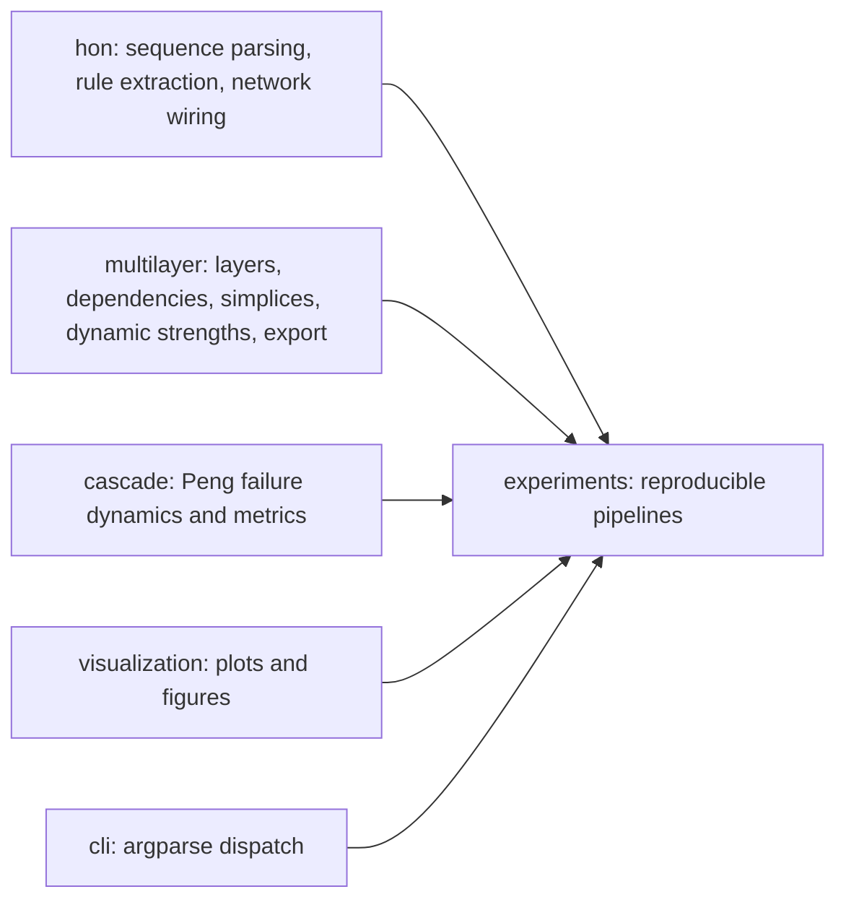
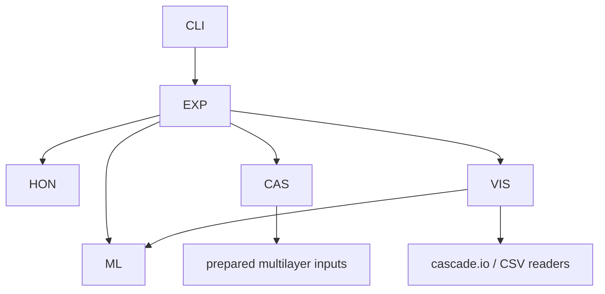

# Architecture

The refactored package uses a `src/` layout:

- `network_science_project.hon`: sequential-data parsing, HON/Cog-HON rule extraction, HON network wiring, and diagnostics.
- `network_science_project.multilayer`: layer management, generated layers, dependency links, simplices, validation, import/export, and Peng input preparation.
  - `network_science_project.multilayer.strength`: shared event-driven strength updates for nodes, links, higher-order simplices, and inter-layer dependencies.
- `network_science_project.cascade`: Peng-style failure propagation and robustness metrics.
- `network_science_project.visualization`: plotting and presentation outputs.
- `network_science_project.experiments`: reproducible workflows that connect packages.
- `network_science_project.cli`: argparse dispatch only.

Legacy folders remain available for backward compatibility. New code should prefer imports from `network_science_project`.

## Responsibility Diagram

## Import Direction

Forbidden boundaries:

- `hon` must not import `multilayer`, `cascade`, or `visualization`.
- `multilayer` must not import `hon`, `cascade`, or `visualization`.
- `cascade` must not import `hon` or `visualization`.
- `visualization` must not run simulations or generate networks.
